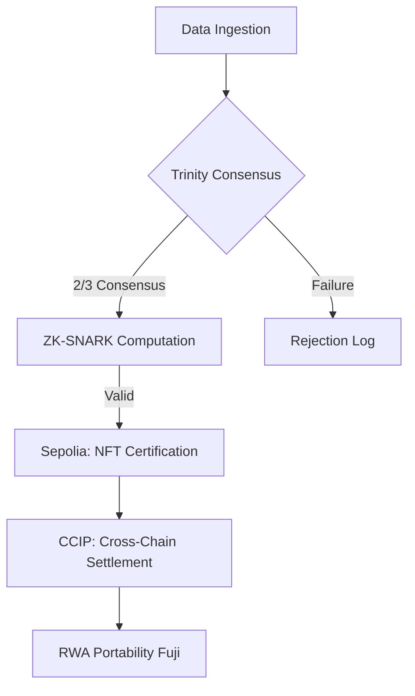

# Protocol Architecture: The Sovereign Membrane

## Institutional Overview
GreenProof is not just an application; it is a **Decentralized Settlement Layer** for the $2.1T Green Bond market. By orchestrating off-chain compute (Zero-Knowledge) and multi-oracle data streams, it transforms ESG compliance into an institutional-grade, portable digital asset.

## The Trinity-HAAS Stack
The protocol’s core is built on **Chainlink Runtime Environment (CRE)**, which serves as the "Sovereign Brain" orchestrating three primary nuclei:

1. **GP-Physical (Sensory Nucleus):** Telemetric ingestion from IoT gateways and satellite imagery.
2. **GP-Juridical (Arbiter Nucleus):** Validation of audit trails and legal compliance frameworks.
3. **GP-Ethical (Value Nucleus):** Global alignment with ESG standards and impact goals.

## Master Lifecycle Flow

## Architectural Scaling: RWA & Green Bonds
While the current implementation focuses on ESG scores, the **Sovereign Membrane** is designed for generic truth settlement:
- **Fractionalized Green Bonds:** Automated interest rates based on real-time ESG performance proofs.
- **DeSci Integration:** Verifiable proof-of-work for environmental research grants.
- **Supply Chain Integrity:** Proof-of-provenance for industrial-scale carbon credits.

## Tech Stack
- **Orchestration:** Chainlink CRE (greenproof-orchestrator.ts)
- **Privacy:** ZK-SNARKs (Circom / snarkjs)
- **Interoperability:** Chainlink CCIP
- **Frontend:** Next.js 14 (Institutional UI/UX)
