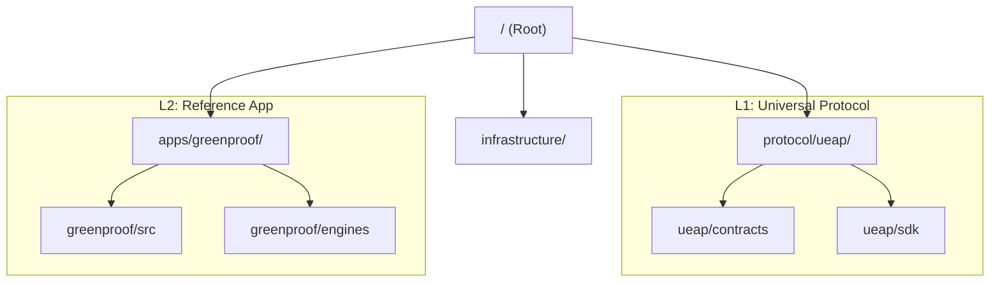

<div align="center">


# GreenProof Platform
**Sovereign ESG Compliance Oracle & Institutional RWA Attestation**

[](https://greenproof.vercel.app)
[](https://github.com/symbeon-labs/greenproof-platform/actions)
[](apps/greenproof/tests/contracts/run-tests.mjs)

</div>

---

## 🏛️ Protocol Snapshot (15 seconds)

GreenProof is a **Cryptographic Method for Real-World Asset Attestation** powered by Distributed Consensus and Zero-Knowledge Proofs.

It replaces manual compliance auditing with a deterministic, privacy-preserving verification pipeline:

```
Real-World Signals → Trinity Consensus → ZK Proof (Groth16) → On-Chain Certificate → Cross-Chain RWA
```

**What you will see in the demo:**
- Oracle consensus (Physical, Legal, Ethical) via **Chainlink CRE**
- **Groth16 ZK-proof** of asset compliance (without exposing sensitive data)
- On-chain certificate **NFT mint** on Ethereum Sepolia
- **Cross-chain portability** via Chainlink CCIP to Arbitrum Sepolia

---

## 🏛️ Technical Verification & Due Diligence

Investors and grant providers can validate the protocol's Proof of Concept (PoC) in under 2 minutes:

| Step | Action | Evidence |
|:---:|:---|:---|
| 1 | Open **Live Dashboard** | [greenproof.vercel.app/dashboard](https://greenproof.vercel.app/dashboard) |
| 2 | Execute **Sovereign Demo** | Triggers the 2/3 Oracle Quorum (CRE-orchestrated) |
| 3 | Monitor **Consensus Event** | High-fidelity log stream available on dashboard |
| 4 | Audit **ZK-Verifier Status** | [/verify ↗](https://greenproof.vercel.app/verify) |
| 5 | Verify **On-Chain Settlement** | [NFT Contract ↗](https://sepolia.etherscan.io/address/0x3fcf2C7f9a0A966810fD7858A99FA915d5326B54) |

---

## 🛡️ [UEAP Protocol Layer](./protocol/ueap)
GreenProof is built on top of the **Universal Event Attestation Protocol**. A generic, ZK-powered layer for creating verifiable evidence of any real-world event.

- **Objective**: Decouple Trust from Semantics.
- **Reference App**: [GreenProof](./apps/greenproof)

---

## 🚀 Rapid Deployment

### Monorepo Setup (Workspaces)
```bash
npm install
```

### Run GreenProof Reference App
```bash
npm run dev
```

---

## 🏗️ Repository Architecture

This repository has been refactored into a **Dual-Layer Architecture** (UEAP + GreenProof) to provide both a generalized protocol and a specific reference implementation.



---

<div align="center">

*Built with ❤️ and sovereign intelligence by **[Symbeon Labs](https://github.com/symbeon-labs)** for the Decentralized Future.*

**[Live Demo](https://greenproof.vercel.app)** · **[Architecture](docs/protocol/ARCHITECTURE.md)**

</div>
