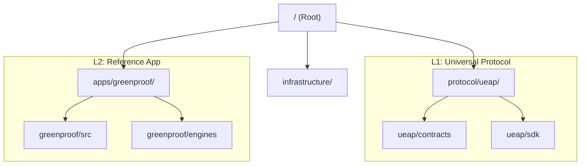

<div align="center">


# GreenProof Platform
**Sovereign ESG Compliance Oracle & Institutional RWA Attestation**

[](https://greenproof.vercel.app)
[](https://github.com/symbeon-labs/greenproof-platform/actions)
[](apps/greenproof/tests/contracts/run-tests.mjs)

</div>

---

## 🏛️ Ecosystem Vision

### **"Prove ESG ≥ 80% without revealing private data. Bridge it to any chain in 1 click."**
> *“Designed to eliminate greenwashing at the infrastructure level.”*

**GreenProof** is a high-fidelity institutional platform for transforming real-world signals into cryptographically verifiable attestations. It replaces manual compliance auditing with a deterministic, privacy-preserving verification pipeline:

```
Real-World Signals → Trinity Consensus → ZK Proof (Groth16) → On-Chain Certificate → Cross-Chain RWA
```

---

## 💡 The Solution

Current ESG (Environmental, Social, and Governance) reporting is plagued by **Greenwashing** and **Data Privacy** concerns. GreenProof solves this by combining:

1.  **Triple Oracle Consensus**: Chainlink oracles ingest data from IoT sensors, LLM reports, and audits.
2.  **ZK Verification**: Proves threshold compliance (`Score >= 80`) without revealing raw datasets.
3.  **On-chain Certification**: Mints a "GreenProof" NFT certificate on Ethereum Sepolia.
4.  **CCIP Interoperability**: Bridges credentials across chains with a single click.

---

## 🛠️ Technical Verification & Due Diligence

Investors and grant providers can validate the Proof of Concept (PoC) in under 2 minutes:

| Step | Action | Evidence |
|:---:|:---|:---|
| 1 | Open **Live Dashboard** | [greenproof.vercel.app/dashboard](https://greenproof.vercel.app/dashboard) |
| 2 | Execute **Sovereign Demo** | Triggers the 2/3 Oracle Quorum (CRE-orchestrated) |
| 3 | Monitor **Consensus Event** | High-fidelity log stream available on dashboard |
| 4 | Audit **ZK-Verifier Status** | [/verify ↗](https://greenproof.vercel.app/verify) |
| 5 | Verify **On-Chain Settlement** | [NFT Contract ↗](https://sepolia.etherscan.io/address/0x3fcf2C7f9a0A966810fD7858A99FA915d5326B54) |

---

## 🏗️ Repository Architecture

This mission is powered by a **Dual-Layer Architecture** that decouples trust from semantics:



- **[UEAP Protocol Layer](./protocol/ueap)**: The generic, ZK-powered engine for verifiable evidence.
- **[GreenProof App](./apps/greenproof)**: The institutional ESG implementation.

---

<div align="center">

*Built with ❤️ and sovereign intelligence by **[Symbeon Labs](https://github.com/symbeon-labs)** for the Decentralized Future.*

**[Live Demo](https://greenproof.vercel.app)** · **[Architecture](docs/protocol/ARCHITECTURE.md)**

</div>
