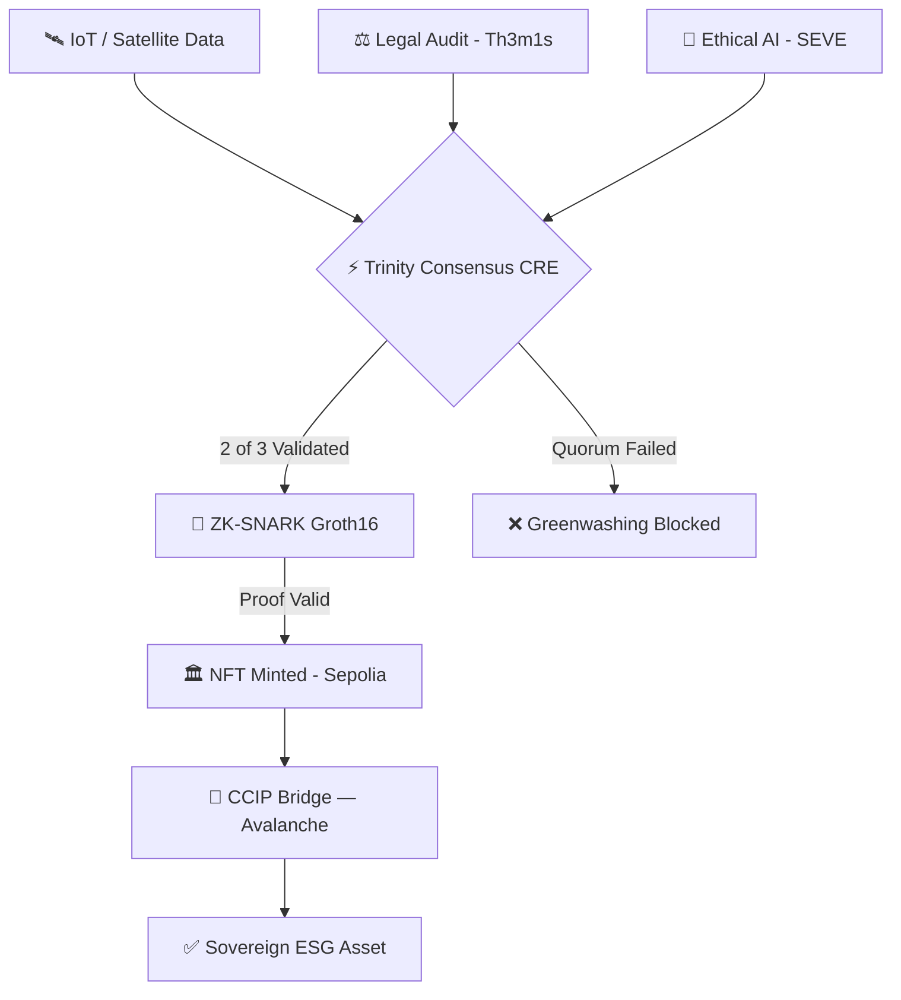

<div align="center">

# GREENPROOF
### *Sovereign RWA Protocol — The Definitive Truth-Layer for ESG Finance*

**🏆 CHAINLINK CONVERGENCE 2026**  
`DeFi & Tokenization` · `Risk & Compliance` · `CRE & AI`

[](https://greenproof-platform.vercel.app)
[](https://github.com/symbeon-labs/greenproof-platform/actions)
[](https://chain.link)
[](https://github.com/symbeon-labs/greenproof-platform)
[](LICENSE)

</div>

---

## TL;DR (30 seconds)

> GreenProof makes **Greenwashing mathematically impossible** by replacing trust-based ESG auditing with cryptographic proof. Three oracles (Physical, Legal, Ethical) reach a **2/3 sovereign consensus**, a **Groth16 ZK-circuit** generates an anonymous compliance certificate, and a **Chainlink CCIP bridge** makes it portable across chains — all in a single automated workflow.

---

## 2-Minute Judge Experience

| Step | Action | Link |
|:---:|:---|:---|
| 1 | Open the **Live Dashboard** | [greenproof-platform.vercel.app/dashboard](https://greenproof-platform.vercel.app/dashboard) |
| 2 | Click **"Execute Sovereign Demo"** | Triggers the CRE-orchestrated 2/3 Quorum |
| 3 | **Verify the Proof** with the generated Certificate ID | [/verify](https://greenproof-platform.vercel.app/verify) |
| 4 | Confirm **On-Chain Truth** on Etherscan | [Sepolia TX →](https://sepolia.etherscan.io/tx/0xe0d518536a83afe148ad1846502b2c9dcaaa3982587b8da480666ed00ef32e4c) |

---

## The Problem: $2.1T Locked by Trust

The global Green Bond market is paralyzed by **Greenwashing**. ESG auditing is slow, manual, and corruption-prone. Asset managers cannot act on data they cannot verify. The result: capital does not flow to where it is needed most.

**GreenProof replaces trust with proof.**

---

## The Solution: Trinity of Proof

A modular, cryptographic consensus engine with three nuclei, unified by **Chainlink CRE**:

```
[IoT / Satellite Data]   ──┐
[Legal Audit (Th3m1s)]   ──┼──▶ 2/3 Quorum ──▶ ZK-SNARK ──▶ NFT-Cert ──▶ CCIP Bridge
[Ethical AI (SEVE)]      ──┘     Consensus      Groth16      Sepolia       Avalanche
   GP-Physical              GP-Juridical       GP-Ethical
```

| Nucleus | Technology | Guarantees |
|:---|:---|:---|
| **GP-Physical** | IoT gateways, Satellite NDVI, Chainlink Functions | Zero-manipulation telemetry |
| **GP-Juridical** | Th3m1s Engine, ERC-3643, ISO-14030 | Full regulatory compliance |
| **GP-Ethical** | SEVE AI, Social Impact Index | Ethical & ESG alignment |

---

## Why We Win

### 🔐 ZK-Privacy (The 10.0 Differentiator)
We implement a **Groth16 circuit** (`circom/ESGScore.circom`) that cryptographically proves `score ≥ 80%` **without exposing any industrial telemetry**. This resolves the core privacy paradox of institutional ESG adoption.

### ⚡ CRE Orchestration (The Automation Engine)
The `cre/greenproof-orchestrator.ts` uses **Chainlink Runtime Environment** to execute the full compliance lifecycle — oracle aggregation, ZK proof trigger, and on-chain minting — autonomously and in a verifiable sequence.

### CCIP Interoperability (The Agnostic Liquidity Layer)
GreenProof is architecturally **Chain-Agnostic**. Once the Triple Oracle Consensus and ZK-Proof are validated off-chain, the issuer chooses the network with the highest liquidity. Utilizing **Chainlink CCIP**, we enable native issuance and synchronization of ESG credentials across:
- **Ethereum Sepolia** (Institutional Settlement)
- **Arbitrum Sepolia** (High-Performance Layer)
- **Avalanche Fuji Testnet** (RWA Subnet Liquidity)

### 🦅 GP-Architect + OpenCLAW (The Sovereign Brain)
The protocol is navigated by **GP-Architect**, a specialized AI agent built on the **OpenCLAW** framework. This is a key architectural innovation: it allows for **Autonomous Protocol Orchestration** without reliance on centralized AI clouds. GP-Architect executes the Trust Handshake, validates the Trinity quorum, and triggers ZK proofs locally — ensuring that data sovereignty and operational logic remain under the user's physical control.

### 🏛️ Institutional Maturity
150+ commits over 28 days. Full CI/CD. Playwright E2E tests. Vercel production. RBAC on all contracts. This is not a POC — it is a **deployable institutional framework**.

---

## Architecture at a Glance

```
greenproof-platform/
├── 🌐 src/app/          ← Next.js 14 frontend (Dashboard, Verify, Architecture)
├── ⚡ cre/              ← Chainlink CRE Orchestrator (greenproof-orchestrator.ts)
├── 🔐 circom/           ← Groth16 ZK-Circuit (ESGScore.circom)
├── ⛓️  contracts/        ← Solidity (GreenProofNFT.sol + CCIPBridge.sol)
├── 🤖 scripts/          ← Deployment & ZK automation tools
├── 🧪 tests/            ← Vitest unit + Playwright E2E
└── 📚 docs/             ← Onboarding Hub (judges / developers / institutional)
```

**Full Stack:**
- **Orchestration**: Chainlink CRE & Functions
- **Privacy**: Circom, Snarkjs (Groth16)
- **Transport**: Chainlink CCIP
- **Security**: OpenZeppelin RBAC
- **Frontend**: Next.js 14, Framer Motion, Three.js
- **Quality**: Vitest, Playwright, ESLint

---

## Protocol Lifecycle



---

## Unit Economics

| Scenario | Monthly Cost | Best For |
|:---|:---|:---|
| **Local Sovereign** (Ollama) | **$0** | Privacy-first operators |
| **Cloud Free-Tier** (Kimi K2.5) | **$0** | Demo & hackathon |
| **Institutional Scale** | **< $10** | Enterprise monitoring |

> [Full Operational Efficiency Report →](docs/institutional/OPERATIONAL_EFFICIENCY.md)

---

## Quick Proof Points

| Claim | Evidence |
|:---|:---|
| ZK-SNARKs Working | `circom/ESGScore.circom` + `scripts/test-zk.ps1` |
| Live On-Chain | [Sepolia NFT #GP-4](https://sepolia.etherscan.io/tx/0xe0d518536a83afe148ad1846502b2c9dcaaa3982587b8da480666ed00ef32e4c) |
| CCIP Bridge Active | `contracts/CCIPBridge.sol` (Verified) |
| CI/CD Passing | [GitHub Actions Badge](https://github.com/symbeon-labs/greenproof-platform/actions) |
| RBAC Hardened | OpenZeppelin AccessControl in all contracts |

---

## Smart Contract Deployments

| Network | Contract Type | Explorer Link |
|:---|:---|:---|
| **Ethereum Sepolia** | GreenProof Core | [0x3fcf...6B54](https://sepolia.etherscan.io/address/0x3fcf2C7f9a0A966810fD7858A99FA915d5326B54) |
| **Arbitrum Sepolia** | GreenProof Core | [0x3fcf...6B54](https://sepolia-explorer.arbitrum.io/address/0x3fcf2C7f9a0A966810fD7858A99FA915d5326B54) |
| **Avalanche Fuji** | GreenProof Core | [0x3fcf...6B54](https://testnet.snowtrace.io/address/0x3fcf2C7f9a0A966810fD7858A99FA915d5326B54) |
| **Chainlink CCIP** | Infrastructure | [CCIP Explorer](https://ccip.chain.link/) |

---

## Onboarding Hub

> [!NOTE]
> Select your track to explore the protocol at your depth:

| Track | For | Entry Point |
|:---:|:---|:---|
| 🏆 **Judges** | Evaluators needing the full picture in 5 minutes | [Start Here →](docs/judges/START_HERE.md) |
| 🛠️ **Developers** | Engineers & architects integrating the protocol | [Start Here →](docs/developers/START_HERE.md) |
| 🏛️ **Institutions** | Partners, investors & legal teams | [Start Here →](docs/institutional/START_HERE.md) |

---

## License & IP

Core Protocol IP protected under pending patent **GP-IP-2026-001** (Symbeon Labs).  
Execution layer released under **[MIT](LICENSE)** for full hackathon transparency.

---

<div align="center">

*Built with ❤️ and sovereign intelligence by **[Symbeon Labs](https://github.com/symbeon-labs)** for the Decentralized Future.*

**[Live Demo](https://greenproof-platform.vercel.app)** · **[Architecture](docs/developers/ARCHITECTURE.md)** · **[Judge Cheat Sheet](docs/judges/JUDGE_CHEATSHEET.md)**

</div>
