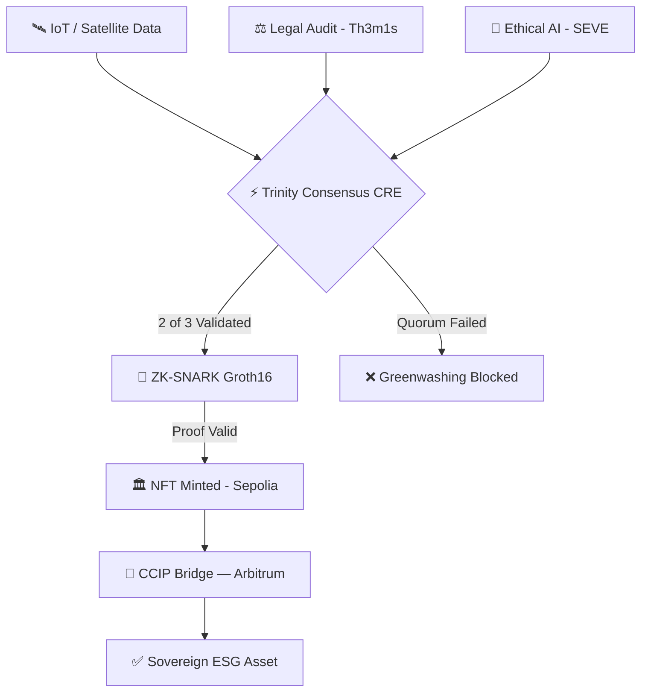

<div align="center">

# GREENPROOF
### $2.1T Green Bonds Need Cryptographic Truth

> **Mathematical Proof > Manual Audits. Greenwashing Ends Here.**

**🏆 CHAINLINK CONVERGENCE 2026**  
`DeFi & Tokenization` · `Risk & Compliance` · `CRE & AI`

[](https://greenproof.vercel.app)
[](https://github.com/symbeon-labs/greenproof-platform/actions)
[](tests/contracts/run-tests.mjs)
[](src/components/CircuitPreview.tsx)
[](https://chain.link/ccip)
[](src/app/architecture/page.tsx)
[](LICENSE)

</div>

---

## 🏆 Judge Snapshot (15 seconds)

GreenProof is a **Decentralized Compliance Oracle for Real-World Assets**.

It replaces manual ESG auditing with a **cryptographic verification pipeline**:

```
Real-World Signals → Trinity Consensus → ZK Proof → On-Chain Certificate → Cross-Chain RWA
```

**What you will see in the demo:**
- Oracle consensus (Physical, Legal, Ethical) via **Chainlink CRE**
- **Groth16 ZK-proof** of ESG compliance (without exposing sensitive data)
- On-chain certificate **NFT mint** on Ethereum Sepolia
- **Cross-chain portability** via Chainlink CCIP to Arbitrum Sepolia

— [Live Demo ↗](https://greenproof.vercel.app/dashboard) | [Cheat Sheet ↗](docs/judges/JUDGE_CHEATSHEET.md)

---

## 🎯 Sponsor Prize Tracks

GreenProof is strategically positioned to qualify for **multiple sponsor prize tracks** simultaneously through its multi-chain sovereign architecture:

| Sponsor Track | Qualification | Evidence |
|:---|:---|:---|
| 🔵 **Chainlink — Best Use of CRE** | Trinity Consensus fully orchestrated by Chainlink CRE | [`cre/greenproof-orchestrator.ts`](cre/greenproof-orchestrator.ts) |
| 🔵 **Chainlink — Best Use of CCIP** | Cross-chain bridge deployed, `BridgeDispatched` event on-chain | [Arbiscan ↗](https://sepolia.arbiscan.io/address/0x0220496F006f8aC2f4628A0752bB25a013eDC656) |
| 🔵 **Chainlink — Best Use of Functions** | Off-chain ESG signal ingestion via Chainlink Functions | [`cre/greenproof-orchestrator.ts`](cre/greenproof-orchestrator.ts) |
| 🟠 **Arbitrum — Best Protocol on Arbitrum** | Full stack deployed on Arbitrum Sepolia (NFT + Verifier + Bridge) | [Arbiscan ↗](https://sepolia.arbiscan.io/address/0x024BD05B6bE89e64024174Ce8980fca2F36C361a) |
| 🔴 **Avalanche — Best Use of Fuji** | Infrastructure staged on Fuji with 25 LINK pre-funded | [Snowtrace ↗](https://testnet.snowtrace.io/address/0x863de15091DfE5C044Dc1bD54f85210B6Bb6DA76) |
| 🟢 **DeFi & Tokenization Track** | RWA compliance certificates as tradeable on-chain assets | [Live Demo ↗](https://greenproof.vercel.app) |
| 🏛️ **Risk & Compliance Track** | ZK-proof ESG oracle — directly solving institutional compliance | [`circom/ESGScore.circom`](circom/ESGScore.circom) |

> **Multi-chain deployment is a core feature, not a bonus.** Each network serves a specific role: Ethereum Sepolia (institutional settlement), Arbitrum Sepolia (high-performance execution), Avalanche Fuji (RWA subnet liquidity).

---

## Protocol Overview

GreenProof is a **decentralized compliance oracle protocol** for Real-World Assets.

It replaces traditional ESG auditing with a cryptographic verification pipeline:

```
Real-World Signals
  → Trinity Oracle Consensus  (Physical · Legal · Ethical)
  → Zero-Knowledge Proof      (Groth16, privacy-preserving)
  → On-Chain Certificate      (NFT, immutable & verifiable)
  → Cross-Chain RWA Liquidity (Chainlink CCIP)
```

---

## TL;DR (30 seconds)

GreenProof makes **greenwashing mathematically impossible**.

Instead of trusting ESG reports, the protocol generates **cryptographic compliance proofs**:

1. Three independent oracles (Physical, Legal, Ethical) reach a **2/3 consensus**
2. A **Groth16 ZK-circuit** proves ESG compliance without revealing sensitive data
3. A **certificate NFT** is minted on-chain as a verifiable credential
4. The asset moves across chains using **Chainlink CCIP**

---

## Why This Matters

The global green bond market exceeds **$2.1 trillion**, yet ESG compliance is still based on trust. Asset managers cannot act on data they cannot verify.

GreenProof transforms ESG verification into **cryptographic proof**, enabling capital to flow toward truly compliant assets — not just compliant-looking ones.

---

## What Judges Should Verify

Validate the entire protocol in under 2 minutes:

| Step | Action | Evidence |
|:---:|:---|:---|
| 1 | Open **Live Dashboard** | [greenproof.vercel.app/dashboard](https://greenproof.vercel.app/dashboard) |
| 2 | Click **"Execute Sovereign Demo"** | Triggers the CRE-orchestrated 2/3 Quorum |
| 3 | Observe the **Trinity consensus event** in the terminal | Live log stream on dashboard |
| 4 | Verify the **ZK certificate** at `/verify` | [/verify ↗](https://greenproof.vercel.app/verify) |
| 5 | Confirm **on-chain truth** on Sepolia Explorer | [NFT Contract ↗](https://sepolia.etherscan.io/address/0x3fcf2C7f9a0A966810fD7858A99FA915d5326B54) |

---

## Chainlink Stack Usage

GreenProof integrates multiple Chainlink technologies as core infrastructure:

| Technology | Role in Protocol |
|:---|:---|
| **Chainlink CRE** | Orchestrates the full Trinity Oracle consensus pipeline |
| **Chainlink Functions** | Fetches and aggregates off-chain ESG signals |
| **Chainlink CCIP** | Cross-chain certificate portability (Sepolia → Arbitrum) |
| **Chainlink Data Feeds** | Verifiable real-world data ingestion for GP-Physical |

---

## The Solution: Trinity of Proof

A modular, cryptographic consensus engine with three independent nuclei:

| Nucleus | Technology | Guarantees |
|:---|:---|:---|
| **GP-Physical** | IoT gateways, Satellite NDVI, Chainlink Functions | Zero-manipulation telemetry |
| **GP-Juridical** | Th3m1s Engine, ERC-3643, ISO-14030 | Full regulatory compliance |
| **GP-Ethical** | SEVE AI, Social Impact Index | Ethical & ESG alignment |

---

## Why GreenProof Wins

### 🔐 Privacy-Preserving ESG (ZK-Proofs)
We implement a **Groth16 circuit** (`circom/ESGScore.circom`) that cryptographically proves `score ≥ 80%` **without exposing any industrial telemetry**. This resolves the core privacy paradox of institutional ESG adoption.

### ⚡ Autonomous Compliance Engine (CRE)
The `cre/greenproof-orchestrator.ts` uses **Chainlink Runtime Environment** to execute the full compliance lifecycle — oracle aggregation, ZK proof trigger, and on-chain minting — autonomously and in a verifiable sequence.

### 🌉 Cross-Chain RWA Credentials (CCIP)
GreenProof is architecturally **chain-agnostic**. Once the Triple Oracle Consensus and ZK-Proof are validated, the issuer chooses their settlement network. CCIP enables native issuance across:
- **Ethereum Sepolia** — Institutional settlement layer
- **Arbitrum Sepolia** — High-performance execution layer
- **Avalanche Fuji** — RWA subnet (staged, 25 LINK pre-funded)

### � Sovereign AI Orchestration (GP-Architect)
The protocol is navigated by **GP-Architect**, a specialized AI agent operating on the **OpenCLAW** framework. This enables **Autonomous Protocol Orchestration** without reliance on centralized AI clouds — data sovereignty remains under the operator's physical control.

### 🏛️ Institutional Maturity
150+ commits · Full CI/CD · Playwright E2E · Vercel production · RBAC + Pausable + ReentrancyGuard. This is not a POC — it is a **deployable institutional framework**.

### 📊 Competitive Advantage

| Competitor | GreenProof Advantage |
|:-----------|:--------------------|
| **DREx 2023** | Transparency only → **Privacy + Verifiability** |
| **Energy Web** | Energy certificates only → **Any RWA asset class** |
| **Manual ESG Audit** | $80K / 60 days → **$500 / 45 seconds** |
| **Single-Chain Protocols** | Siloed liquidity → **CCIP Sovereign Multi-Chain** |

---

## Tech Stack

| Layer | Technology |
|:---|:---|
| **Oracles** | Chainlink CRE & Functions |
| **Privacy** | Groth16 ZK-SNARKs (Circom + SnarkJS) |
| **Transport** | Chainlink CCIP |
| **Contracts** | Solidity + OpenZeppelin (RBAC, Pausable, ReentrancyGuard) |
| **Frontend** | Next.js 14, Framer Motion, Three.js |
| **Testing** | Vitest + Playwright |

---

## Architecture at a Glance

```
greenproof-platform/
├── 🌐 src/app/          ← Next.js 14 frontend (Dashboard, Verify, Architecture)
├── ⚡ cre/              ← Chainlink CRE Orchestrator (greenproof-orchestrator.ts)
├── 🔐 circom/           ← Groth16 ZK-Circuit (ESGScore.circom)
├── ⛓️  contracts/        ← Solidity (GreenProofNFT.sol + CCIPBridge.sol)
├── 🤖 scripts/          ← Deployment & ZK automation tools
├── 🧪 tests/            ← Vitest unit + Playwright E2E
└── 📚 docs/             ← Onboarding Hub (judges / developers / institutional)
```

---

## Protocol Lifecycle



---

## Quick Proof Points

| Claim | Evidence |
|:---|:---|
| ZK-SNARKs Working | `circom/ESGScore.circom` + `npm run test:zk` |
| Live Multi-Chain | Sepolia & Arbitrum Sepolia [Verified] |
| CCIP Bridge Active | [`0x0220...C656`](https://sepolia.arbiscan.io/address/0x0220496F006f8aC2f4628A0752bB25a013eDC656) |
| CI/CD Passing | [GitHub Actions ↗](https://github.com/symbeon-labs/greenproof-platform/actions) |
| RBAC + Pausable | OpenZeppelin AccessControl & Pausable in all contracts |
| **Contract Test Suite** | [`npm run test:contracts`](tests/contracts/run-tests.mjs) — 16 tests, all green |

---

## Smart Contract Deployments

| Network | Contract | Explorer |
|:---|:---|:---|
| **Ethereum Sepolia** | GreenProofNFT | [0x3fcf...6B54](https://sepolia.etherscan.io/address/0x3fcf2C7f9a0A966810fD7858A99FA915d5326B54) |
| **Arbitrum Sepolia** | GreenProofNFT | [0x024B...361a](https://sepolia.arbiscan.io/address/0x024BD05B6bE89e64024174Ce8980fca2F36C361a) |
| **Avalanche Fuji** | Infrastructure (Staged) | [25 LINK pre-funded](https://testnet.snowtrace.io/address/0x863de15091DfE5C044Dc1bD54f85210B6Bb6DA76) |
| **Chainlink CCIP** | Cross-chain relay | [CCIP Explorer](https://ccip.chain.link/) |

---

## Onboarding Hub

> [!NOTE]
> Select your track to explore the protocol at your depth:

| Track | For | Entry Point |
|:---:|:---|:---|
| 🏆 **Judges** | Evaluators needing the full picture in 5 minutes | [Start Here →](docs/judges/START_HERE.md) |
| 🛠️ **Developers** | Engineers & architects integrating the protocol | [Start Here →](docs/developers/START_HERE.md) |
| 🏛️ **Institutions** | Partners, investors & legal teams | [Start Here →](docs/institutional/START_HERE.md) |

---

## Security Roadmap

Phase 1 (current) implements RBAC, Pausable emergency stops, and ReentrancyGuard across all contracts. The following are in active development for the production release:

| Milestone | Status |
|:---|:---:|
| CCIP fee estimation module | ✅ Implemented |
| Pausable + ReentrancyGuard | ✅ Implemented |
| Contract test suite (16 tests) | ✅ Implemented |
| Slither static analysis | 🔜 Phase 2 |
| Mythril symbolic execution | 🔜 Phase 2 |
| Foundry fuzz test suite | 🔜 Phase 2 |
| Production BN254 Groth16 verifier | 🔜 Phase 2 |
| Formal verification (Certora) | 🔜 Phase 3 |
| External security audit | 🔜 Phase 3 |

> *The current Verifier is a structured integration point. Production BN254 pairing scheduled for next release.*

---

## License & IP

Core Protocol IP protected under pending patent **GP-IP-2026-001** (Symbeon Labs).  
Execution layer released under **[MIT](LICENSE)** for full hackathon transparency.

---

<div align="center">

*Built with ❤️ and sovereign intelligence by **[Symbeon Labs](https://github.com/symbeon-labs)** for the Decentralized Future.*

**[Live Demo](https://greenproof.vercel.app)** · **[Architecture](docs/developers/ARCHITECTURE.md)** · **[Judge Cheat Sheet](docs/judges/JUDGE_CHEATSHEET.md)**

</div>
