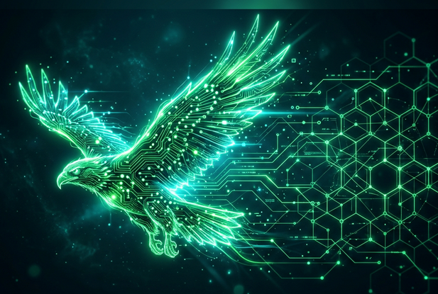
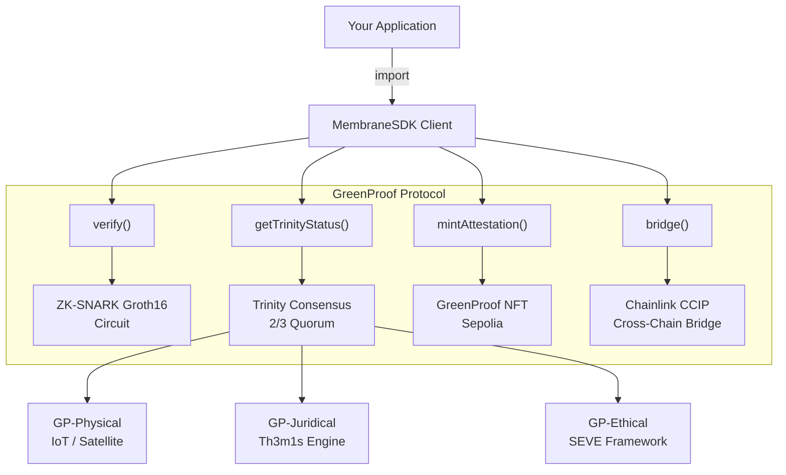
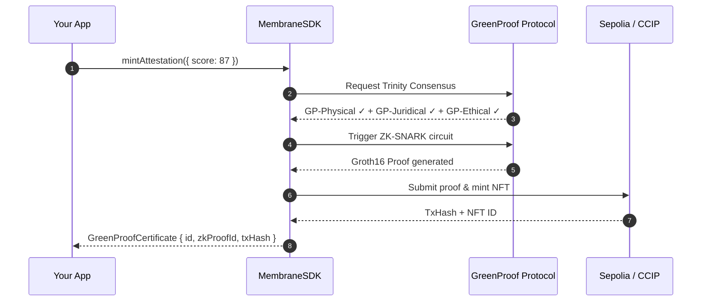
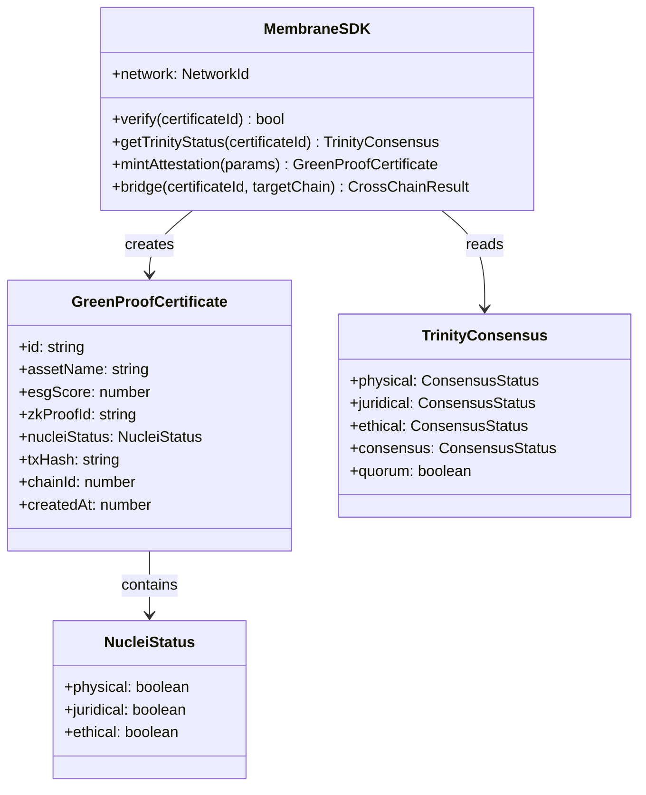

<div align="center">


# @greenproof/membrane-sdk

**The Official TypeScript SDK for the GreenProof Universal Trust Protocol**

[](https://www.npmjs.com/package/@greenproof/membrane-sdk)
[](https://github.com/symbeon-labs/membrane-sdk/actions)
[](LICENSE)
[](https://www.typescriptlang.org/)
[](https://chain.link/)

*Integrate sovereign ESG attestation, ZK-proof verification, and cross-chain RWA minting into any application or AI agent in minutes.*

</div>

---

## 🏗️ Architecture Overview



---

## 📦 Installation

```bash
npm install @greenproof/membrane-sdk
# or
yarn add @greenproof/membrane-sdk
```

---

## ⚡ Quick Start

```typescript
import { MembraneSDK } from "@greenproof/membrane-sdk";

const sdk = new MembraneSDK({ network: "sepolia" });

// Verify an existing certificate (ZK-proof check)
const isValid = await sdk.verify("GP-2026-NUCLEUS-01");

// Get Trinity Consensus status
const status = await sdk.getTrinityStatus("GP-2026-NUCLEUS-01");
console.log(status.consensus); // "VALIDATED" | "PENDING" | "FAILED"

// Mint a new RWA attestation
const cert = await sdk.mintAttestation({
  assetName: "AmazonAsset-01",
  esgScore: 87,
  jurisdiction: "BR",
});
console.log(cert.id); // "GP-2026-XXXX"
```

---

## 🔄 SDK Data Flow



---

## 📐 Type System



---

## 🌐 Multi-Network Support

| Network | Chain ID | Status |
|:---|:---|:---|
| **Sepolia** (Primary) | `11155111` | ✅ Active |
| **Avalanche Fuji** | `43113` | ✅ CCIP Bridge |
| **Arbitrum Sepolia** | `421614` | 🔜 Planned |
| **Polygon Mumbai** | `80001` | 🔜 Planned |

---

## 🤖 AI Agent Integration (MCP)

The SDK is fully compatible with **OpenCLAW / AQUILA** sovereign agents:

```typescript
// Inside AQUILA's orchestration loop:
const sdk = new MembraneSDK({ network: "sepolia" });

// Agent checks consensus before triggering ZK proof
const trinity = await sdk.getTrinityStatus(assetId);
if (trinity.quorum) {
  const cert = await sdk.mintAttestation({ assetName, esgScore });
  await sdk.bridge(cert.id, "avalanche-fuji");
}
```

---

## 🏛️ Related Repositories

| Repository | Description |
|:---|:---|
| [greenproof-platform](https://github.com/symbeon-labs/greenproof-platform) | Main protocol orchestration layer |
| [aquila-ark](https://github.com/symbeon-labs/aquila-ark) | Sovereign AI agent (AQUILA) |
| [agent-nursery-framework](https://github.com/symbeon-labs/agent_nursery_framework) | Agent incubation and governance |

---

## 📄 License

MIT © [Symbeon Labs](https://github.com/symbeon-labs)
