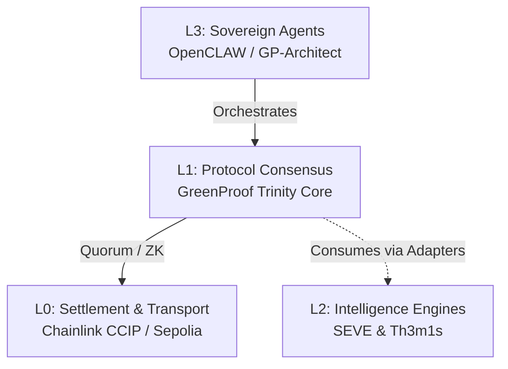

# 📐 GreenProof: Modular Trust Architecture

GreenProof is designed as a **Sovereign Orchestration Layer** that decouples the protocol's consensus mechanism from specialized intelligence engines. This modularity ensures scalability, privacy, and institutional grade reliability.

## 🧬 The Modular Trust Stack

The protocol operates across four distinct layers of specialized logic:

---

### 🏛️ Nucleus I: Juridical (Th3m1s)
**Source**: `engines/th3m1s` (Git Submodule)
**Role**: Automated legal compliance and regulatory audit. The Th3m1s engine ensures that every RWA asset meets institutional standards such as ISO-14030 and ERC-3643.

### 🧠 Nucleus II: Ethical (SEVE)
**Source**: `engines/seve` (Git Submodule)
**Role**: Ethical AI alignment and social impact scoring. The SEVE framework validates the "Green" in GreenProof, ensuring that assets are not just legally compliant, but also ethically aligned with ESG values.

### 🛰️ Nucleus III: Physical (IoT/NDVI)
**Role**: Real-time telemetry monitoring. This nucleus consumes data from IoT gateways and satellite NDVI feeds via Chainlink Functions, providing the empirical foundation of the protocol's consensus.

---

### 🔌 Engine Adapters

To maintain strict decoupling, GreenProof uses standardized adapters to interact with external engines:

- **Juridical Adapter**: `src/lib/engines/themis-adapter.ts`
- **Ethical Adapter**: `src/lib/engines/seve-adapter.ts`

These adapters allow the protocol to be **engine-agnostic**, enabling the integration of different legal or ethical frameworks without modifying the core consensus logic.

---

### 🦅 Sovereign Orchestration (MCP)

Integration between these layers is managed through the **Model Context Protocol (MCP)**, allowing autonomous agents to verify state and trigger attestations across the modular stack in a zero-trust environment.
