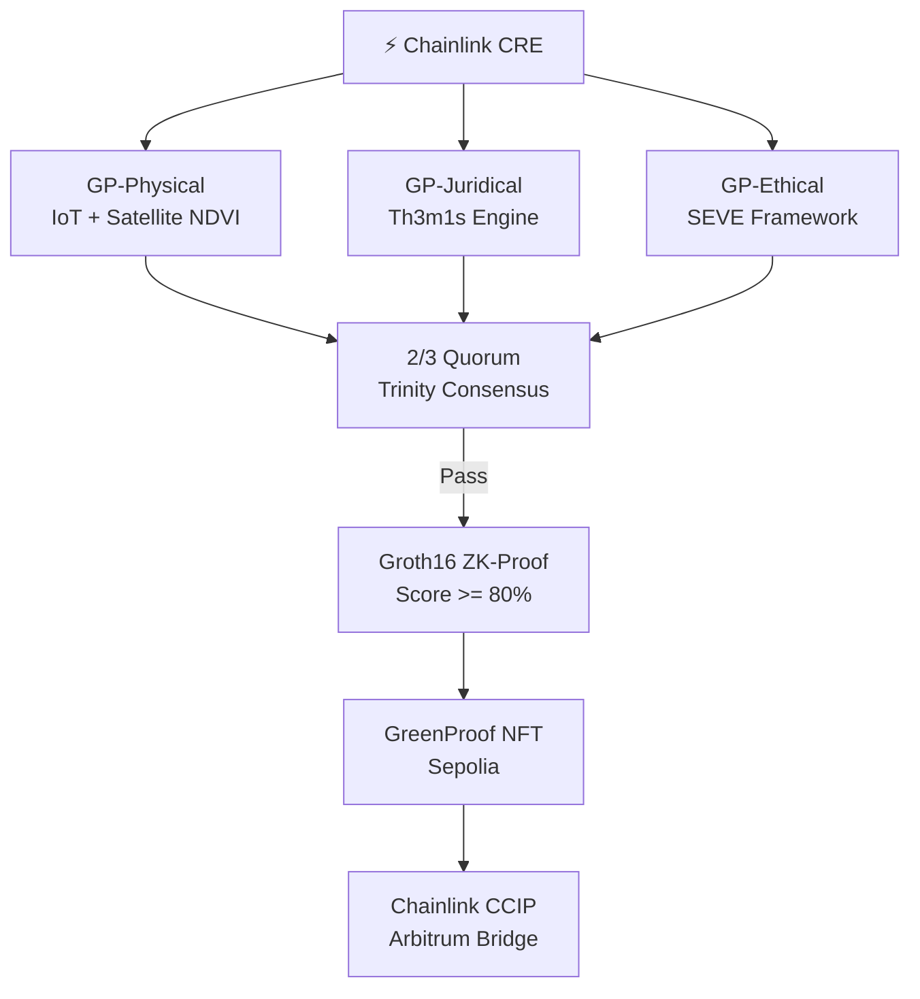

# GreenProof × Chainlink BUILD Program

## Application: Cryptographic RWA Attestation Protocol

---

## Project Overview

**Protocol Name**: GreenProof  
**Category**: DeFi & RWA Infrastructure  
**Stack**: Chainlink CRE + Functions + CCIP + ZK-SNARKs (Groth16)  
**Live Demo**: https://greenproof.vercel.app  
**Repository**: https://github.com/symbeon-labs/greenproof-platform  

---

## What We Built

GreenProof implements a **cryptographic method for environmental asset attestation via distributed consensus with zero-knowledge proofs**. It enables any real-world asset (RWA) to be certified as ESG-compliant without exposing proprietary industrial data.

### Chainlink Usage (Native, Not Cosmetic)

| Chainlink Product | Usage |
|:---|:---|
| **CRE (Runtime Environment)** | Orchestrates the Trinity Consensus lifecycle across 3 oracle nodes |
| **Functions** | Ingests real-time IoT telemetry and NDVI satellite data (GP-Physical) |
| **CCIP** | Bridges the ERC-721 compliance certificate from Sepolia to Arbitrum |

---

## Technical Architecture

## Why BUILD?

1. **Chainlink-Native Architecture**: CRE + CCIP + Functions are load-bearing components, not integrations.
2. **Proven On-Chain**: Contract deployed and verified on Sepolia. NFT minted. CCIP bridge active.
3. **Developer Ecosystem Ready**: `@greenproof/membrane-sdk` enables 3rd party integrations.
4. **Agentic Layer**: AQUILA (GP-Architect) uses the Sovereign MCP to orchestrate the entire pipeline autonomously.

---

## Proof Points

| Claim | Evidence |
|:---|:---|
| CRE Orchestration | `cre/greenproof-orchestrator.ts` |
| ZK-SNARKs Working | `circom/ESGScore.circom` + Groth16 proof |
| Live On-Chain | [Sepolia TX →](https://sepolia.etherscan.io/tx/0xe0d518536a83afe148ad1846502b2c9dcaaa3982587b8da480666ed00ef32e4c) |
| CCIP Bridge Active | `contracts/CCIPBridge.sol` |
| SDK Consumable | [membrane-sdk →](https://github.com/symbeon-labs/membrane-sdk) |
