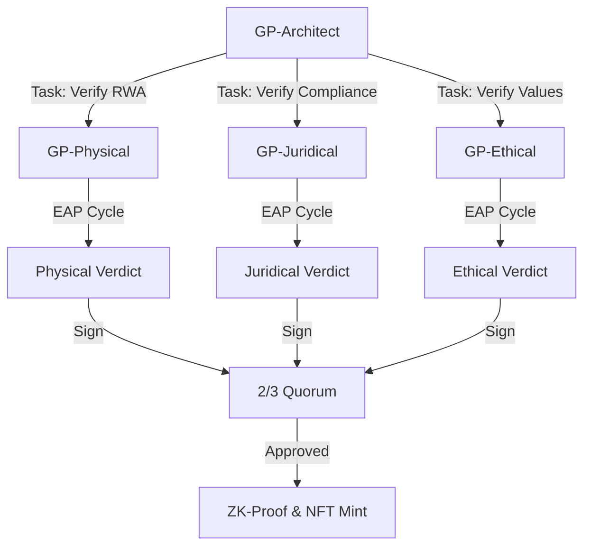

# 🔁 The EAP Synchronization Cycle: The Trinity in Motion

Each core in the **GreenProof Trinity** operates on a recursive **Exploration -> Analysis -> Proof (EAP)** cycle, powered by the HAAS orchestration layer.

---

## 🔍 Exploration (E)
The agent aggressively ingests data from its specialized domain.
- **Physical**: Real-time telemetric signals (Chainlink Functions).
- **Juridical**: Regulatory JSONs and legal audit trails.
- **Ethical**: Governance manifestos and social impact reports.

## 🧠 Analysis (A)
The agent processes the ingested data using its **Inherited Engine** (Rust/TS).
- **Logic**: Cross-referencing against the **Sovereign Skills** (Th3m1s/SEVE).
- **Rigor**: Arithmetic verification of thresholds (Score calculations).

## 🛡️ Proof (P)
The agent produces a **Cryptographic Verdict**.
- **Signature**: A secure signature proving the agent's identity and its specific score.
- **Commitment**: The verdict is sent to the **GP-Architect (Master Core)** for 2/3 consensus.

---

### HAAS Orchestration Example:

---
**Status**: HAAS Lifecycle Formalized 🟢  
**Authored by**: GreenProof Foundation
