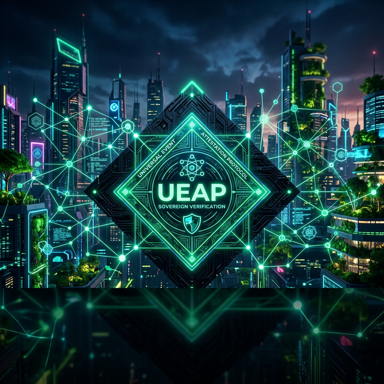

<div align="center">


# Universal Event Attestation Protocol (UEAP)

**The Global Standard for Cryptographically Verifiable Event Attestations**

---

[](LICENSE)
[](https://chain.link/)
[](https://github.com/symbeon-labs/universal-event-attestation-protocol)

</div>

## 🌌 Overview

UEAP is a modular, high-velocity protocol designed to create **Sovereign Evidence**. It decouples the act of observing an event from the cryptographic proof required to trust it, enabling anyone to register and verify real-world occurrences with mathematical certainty.

---

## 🏗️ Technical Architecture

```mermaid
graph TD
    subgraph "Emit Phase"
        Event["UEAP Event\n(Schema)'] --> Hash["Deterministic\nKeccak256 Hash"]
    end

    subgraph "Prove Phase"
        Hash --> ZK["ZK-Verifier\n(Groth16)"]
        Hash --> Oracle["Chainlink CRE\n(Oracle Consensus)"]
    end

    subgraph "Register Phase"
        ZK --> Registry["Attestation Registry\n(Smart Contract)"]
        Oracle --> Registry
    end

    subgraph "Consume Phase"
        Registry --> GP["GreenProof\n(ESG Compliance)"]
        Registry --> GD["GuardDrive\n(Vehicle Telemetry)"]
        Registry --> SD["Symbeon DNA\n(AI Governance)"]
    end

    style Registry fill:#00FF88,stroke:#333,stroke-width:4px
    style ZK fill:#111,stroke:#00FF88
    style Oracle fill:#111,stroke:#00FF88
```

---

## 🛠️ Developer SDK

Integrating UEAP is simple by design.

```typescript
import { UEAP } from "@ueap/sdk";

// 1. Create a standardized event
const event = UEAP.createEvent({
  actor: "Satellite-01",
  action: "Climate.Change",
  object: "Amazon-Region-A4",
  location: "BR",
  evidence: "temp: 42.5; humidity: 12"
});

// 2. Generate Attestation (Proof + Registry Handshake)
const attestation = await UEAP.generateAttestation(event, issuer, proof);

// 3. Verify Anywhere
const isValid = await UEAP.verify(attestation.id);
```

---

## 🏛️ Reference Implementation

The [**GreenProof Platform**](../../apps/greenproof) is the official reference implementation of UEAP, demonstrating how to use the protocol for global ESG compliance and RWA minting.

---

## 📜 Specification

For an indepth look at the mathematical and logical foundations, see [**UEAP_SPEC.md**](../../UEAP_SPEC.md).

---

*Built with ❤️ for a Sovereign Future by Symbeon Labs.*
